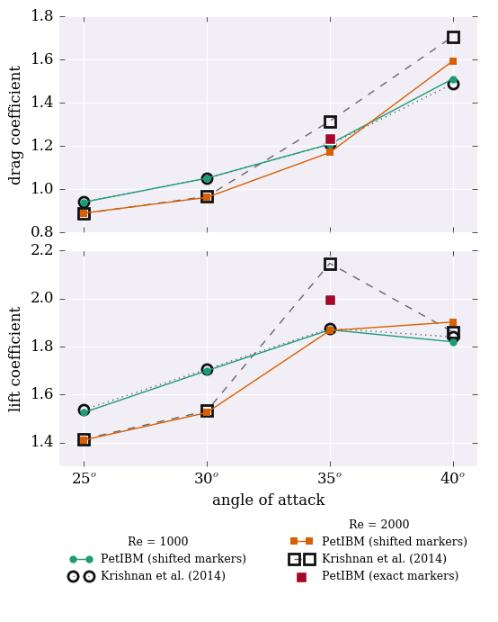
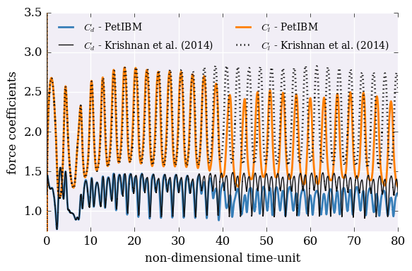
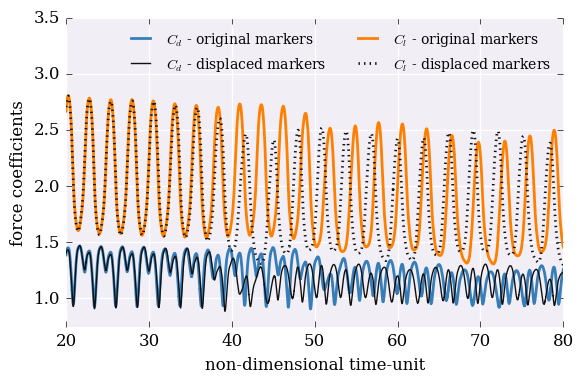
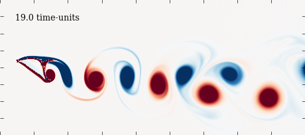
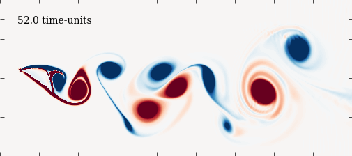
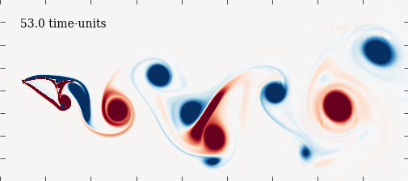
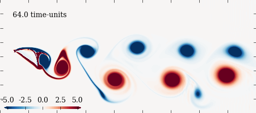
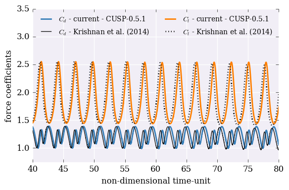
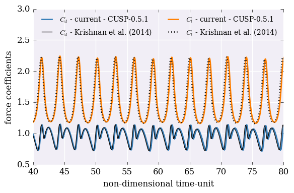
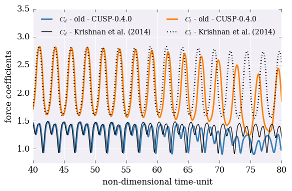

#Reproducible and replicable computational fluid dynamics: it’s harder than you think

**Olivier Mesnard, Lorena A. Barba**

Our research group prides itself for having adopted Reproducible Research practices. 
Barba made a public pledge titled *"Reproducibility PI Manifesto"* ^(1) (PI: Principal Investigator), which at the core is a promise to make all research materials and methods open access and discoverable: releasing code, data and analysis/visualization scripts.

In 2014, we published a study on Physics of Fluids titled *"Lift and wakes of flying snakes."* ^(2) 
It is a study that uses our in-house code for solving the equations of fluid motion in two dimensions (2D), with a solution approach called “immersed boundary method.” 
The key of such a method for solving the equations is that it exchanges complexity in the mesh generation step for complexity in the application of boundary conditions. 
It makes possible using a simple discretization mesh (structured Cartesian), but at the cost of an elaborate process that interpolates values of fluid velocity at the boundary points to ensure the no-slip boundary condition (that fluid sticks to a wall). 
The main finding of our study on wakes of flying snakes was that the 2D section with anatomically correct geometry for the snake’s body experiences lift enhancement at a given angle of attack.
A previous experimental study had already shown that the lift coefficient of a snake cross section in a wind tunnel gets an extra oomph of lift at 35 degrees angle-of-attack. 
Our simulations showed the same feature in the plot of lift coefficient.^(3) 
Many detailed observations of the wake (visualized from the fluid-flow solution in terms of the vorticity field in space and time) allowed us to give an explanation of the mechanism providing extra lift.

When a computational research group produces this kind of study with an in-house code, it can take one, two or even three years to write a full research software from scratch, and complete verification and validation. 
Often, one gets the question: why not use a commercial CFD package? (CFD: computational fluid dynamics.) 
Why not use another research group’s open-source code? 
Doesn't it take much longer to write yet another CFD solver than to use existing code? 
Beyond reasons that have to do with inventing new methods, it’s a good question. 
To explore using an existing CFD solver for future research, we decided to first complete a full replication of our previous results with these alternatives. 
Our commitment to open-source software for research is unwavering, which rules out commercial packages. 
Perhaps the most well known open-source fluid-flow software is OpenFOAM, so we set out to replicate our published results with this code. 
A more specialist open-source code is IBAMR, a project born at New York University that has continued development for a decade. 
And finally, our own group developed a new code, implementing the same solution method we had before, but providing parallel computing via the renowned PETSc library. 
We embarked on a full replication study of our previous work, using three new fluid-flow codes.

This is the story of what happened next: three years of dedicated work that encountered a dozen ways that things can go wrong, conquered one after another, to arrive finally at (approximately) the same findings and a whole new understanding of what it means to do “reproducible research” in computational fluid dynamics.

--

> ###Fluid-flow solvers we used
> **cuIBM**--- Used for our original study (Krishan et al., 2014), this code is written in C CUDA to exploit GPU hardware, but is serial on CPU. 
> It uses the NVIDIA *Cusp* library for solving sparse linear systems on GPU. 
> <https://github.com/barbagroup/cuIBM>  
> **OpenFOAM**--- A free and open-source CFD package that includes a suite of numerical solvers.
> The core discretization scheme is a finite-volume method applied on mesh cells of arbitrary shape. 
> <http://www.openfoam.org>  
> **IBAMR**--- A parallel code using the immersed boundary method on Cartesian meshes, with adaptive mesh refinement.
> <https://github.com/ibamr/ibamr>  
> **PetIBM**--- Our own re-implementation of *cuIBM*, but for distributed-memory parallel systems.
> It uses the PETSc library for solving sparse linear systems in parallel.
> <https://github.com/barbagroup/PetIBM> 

--

### Story 1: Meshing and boundary conditions can ruin everything

Generating good discretization meshes is probably the most vexing chore of computational fluid dynamics. 
And stipulating boundary conditions on the edge of a discretization mesh takes some nerve, too. 
Our first attempts at a full replication study of the 2D snake aerodynamics with OpenFOAM showed us just how vexing and unnerving this can be.

OpenFOAM can take various types of discretization mesh as input. 
One popular mesh generator is called GMSH: it produces triangles that are as fine as you want them near the body, while getting coarser as the mesh points are farther away. 
Already, we encounter a problem: how to create a mesh of triangles that gives a comparable resolution to that obtained with our original structured Cartesian mesh? 
After dedicated effort (see separate section on mesh generation with OpenFOAM [or supplementary material?]), we produced the best mesh we could that matches our previous study in the finest cell width near the body. 
But when using this mesh to solve the fluid flow around the snake geometry, we got spurious specks of high vorticity in places where there shouldn’t be any (Figure 1). 
The simulations did not blow up, but these unphysical vortices appeared for any flow Reynolds number or body angle of attack we tried.
This is despite the fact that the mesh passed the quality checks of OpenFOAM. 
Finally, we gave up with the (popular) GMSH and tried another mesh generator: SnappyHexMesh. 
Success! 
No unphysical patches in the vorticity field this time. 
But another problem persisted: after the wake vortices hit the edge of the computational domain in the downstream side, a nasty back pressure appeared there and started propagating to the inside of the domain (Figure 2). 
This situation is also unphysical, and we were certain there was a problem with the chosen outflow boundary condition in OpenFOAM, but did not find any way to stipulate another, more appropriate boundary condition. 
We used a zero-gradient condition for the pressure at the outlet, which we found was a widespread choice in the examples and documentation of OpenFOAM. 
After months, one typing mistake when launching a run from the command line made OpenFOAM print out the set of available boundary conditions, and we found that an _advective_ condition was available that could solve our problem (all this time, we were looking for a _convective_ condition, which is just another name for the same thing). 
Finally, simulations with OpenFOAM were looking correct—and happily, the main feature of the aerodynamics was replicated: an enhanced lift coefficient at 35º angle-of-attack (Figure 3). 
But not all is perfect. 
The time signatures of lift and drag coefficient do show differences between our OpenFOAM calculation and the original published ones (Figure 4). 
The key finding uses an _average_ lift coefficient, calculated with data in a time range that is reasonable but arbitrary. 
Although the average force coefficients match (within <3%) our previous results, the time series shows a phase difference. 
Are these the same solutions? 
Is it acceptable as a replication study? 
We think yes, but this is a judgement call.

**Postmortem**. 
OpenFOAM solves the fluid equations using a finite-volume method in an unstructured grid, while our published study used an immersed boundary method in a stretched Cartesian grid. 
Comparing results obtained under such different conditions is a delicate operation. 
We made our best attempt at creating a fluid mesh for OpenFOAM that was of similar resolution near the body as we had used before. 
But unstructured grids are complex geometrical objects. 
Two unstructured meshes built with the same parameters will not be exactly the same, even. 
The mesh-generation procedures are not necessarily deterministic, and regularly produce bad triangles that need to be repaired. 
The complications of building a _good quality_ mesh is one of the reasons some prefer immersed boundary methods!

Figure 1: 
Vorticity field after 52 time-units of flow-simulation with IcoFOAM for a snake's section with angle-of-attack 35° and Reynolds number 2000.
We created a triangular mesh (about 700k triangles) with the free software GMSH.

Figure 2:
Pressure field after 52 (top) and 53 (bottom) time-units of flow-simulation with IcoFOAM for snake section with angle-of-attack 35° and Reynolds number 2000.

Figure 3:
Time-averaged drag (top) lift (bottom) coefficients as function of the snake's angle-of-attack for Reynolds numbers 1000 and 2000.
We averaged all IcoFOAM force coefficients between 32 and 64 time-units of flow-simulation as we have done in our previous study.

Figure 4:
Instantaneous force coefficients on the snake's section with angle-of-attack 30° (top) and 35° (bottom) at Reynolds number 2000.
We compare the IcoFOAM results with the cuIBM results from our previous study.
We created a 3.4 million cells (mostly hexahedra) with SnappyHexMesh, one of the OpenFOAM mesh utilities.

### Story 2: Other researchers' open-source codes come with traps

Open-source research software can often be poorly documented and unsupported, and on occasion it can even be an unreadable mess. 
But in this case, we are in luck.
IBAMR is a solid piece of software, well documented, and you can even get swift response from the authors via the topical online forum.
Still, we ran against an obscure trick of the trade that changed our results completely. 

The numerical approach in IBAMR belongs to the same family as that used in our published work on wakes of flying snakes: an immersed boundary method. 
The essence of the approach is that the fluid is represented by a fixed structured mesh, while the immersed body is represented by its own, separate mesh that moves with the body. 
We speak of an Eulerian mesh for the fluid, and a Lagrangian mesh for the solid. 
The forces exerted by the fluid on the body, and vice versa, appear as an additional integral equation and interpolation schemes between the two meshes. 
The role of these is to make the fluid "stick" to the wall (no-slip boundary condition) and allow the body to feel aerodynamic forces (lift and drag).
Our cuIBM code uses a variant called the immersed boundary projection method,^(4) while IBAMR uses a form called the "direct-forcing" method. 
Despite the variations, the essence is the same, and it is reasonable to assume they would work similarly.

We already know that boundary conditions at the outlet of the computational domain can be problematic. This is no different with immersed boundary methods. 
Our first attempt with IBAMR used a zero-gradient velocity boundary condition at the outlet. 
This resulted in some blockage effect when the wake vortices reach the domain boundary: strong vorticity rebounds from the artificial boundary and propagates back to the domain (Figure 5). 
Of course, this is unphysical and the result unacceptable. 
After a long search in the literature and in the code documentation, we discovered that IBAMR needs us to select a "stabilized outlet," which is a boundary condition that acts like a force pushing the vortices out. 
(IBAMR does not provide a convective/advective boundary condition.) 
With this new configuration, the simulations of the snake profile resulted in a wake that looked physical, but a computed lift coefficient that was considerably different from our published study (Figure 6). 
Another deep dive in the literature led us to notice that a benchmark example described in a paper describing extensions to IBAMR^(5) was set up in an unexpected way: 
the no-slip condition is forced _inside_ the body, and not just on the boundary. 
As far as we could find, the publications using IBAMR are the only cases where interior points are constrained. 
Other papers using immersed boundary methods apply the constraint only on boundary points.
When we followed their example, our simulations with IBAMR were able to reproduce the lift enhancement at 35 degrees angle-of-attack, although with a slightly different value of average lift (<5% off). 
The successful result comes with a caveat, though. 
If we look at the time signature of the lift and drag coefficients, there is excellent agreement with our previous results for 30 degrees angle-of-attack (Re=2000). 
But at 35 degrees, the time signatures drift apart after about 40 time units (more than 150 thousand time steps). 
There is a marked drop in the (time varying) lift coefficient (Figure 7(b)), but because the average is calculated over a time range between 32 and 64 time units (a reasonable but arbitrary choice), the final numeric result is not far off our published study. 
Like in the previous case, using OpenFOAM, we make a judgement call that this result does indeed pass muster as a replication of our previous study. 
 
**Postmortem**. 
Even a well-documented open-source research code can have unexpected tricks of the trade that only the original authors may know about. 
In the end, we don't know _why_ IBAMR required interior body points to be constrained. 
The published record is incomplete in this regard: we could find no explanation for it in any paper using IBAMR. 
One of the issues may be that our community does not have a habit of communicating negative results, nor of publishing papers about software. 
We learned from this experience that using an open research code and getting correct results with it could involve a long investigative period, potentially requiring communication with the original authors and many failed attempts. 
If the code is not well documented and the original authors not responsive to questions, then building your own code from scratch could be more sensible!

Figure 5:
Vorticity field after about 61 time-units of flow-simulation with IBAMR for a snake's section with angle-of-attack 35° and Reynolds number 2000.
We used a zero-gradient condition at the outlet for both the velocity and pressure quantities.

Figure 6:
Time-averaged drag (top) and lift (bottom) coefficients as function of the angle-of-attack of the snake's section for Reynolds numbers 1000 and 2000.
We averaged each force signal between 32 and 64 time-units of flow-simulation with IBAMR to compare with the results from our previous investigation..

Figure 7:
Instantaneous force coefficients at Reynolds number 2000 for the snake's section at angle-of-attack 30° (top) and 35° (bottom).
Here, the no-slip condition is enforced inside the section.
We compare the IBAMR results with cuIBM ones from our past study.

### Story 3: All linear algebra libraries are not created equal

Our previous study used cuIBM, running on a single GPU device. 
The largest problem that we can fit in the memory of a high-end GPU has just a few million mesh points, which is not enough to solve three-dimensional flows. 
We developed PetIBM, a code that uses the same mathematical formulation as cuIBM, to allow solving larger problems on distributed CPU systems. 
Since PetIBM and cuIBM implement exactly the same numerical method, you'd expect that giving the two codes the same mesh with the same initial conditions will result in the same solution (within floating-point error). 
Not so fast! 
We rely on external libraries to solve sparse linear systems of equations: _Cusp_ for GPU devices and PETSc for distributed CPU systems. 
It turns out, the iterative solvers may have differences that affect the final solution.

When repeating our previous simulations of the aerodynamics of a snake cross-section with PetIBM, the solutions do not always match those with cuIBM. 
At a Reynolds number of 1000, both the time-averaged lift and drag coefficients match. 
But at Reynolds equal to 2000, average lift and drag match up to 30 degrees angle-of-attack, but not at 35 degrees. 
That means that we don't see lift enhancement (Figure 8) and the main finding of our previous study is not fully replicated. 
Looking at the time evolution of the force coefficients for the simulation with PetIBM at Re=2000 and 35 degrees angle-of-attack, we see a marked drop in lift after 35 time units (top graph in Figure 9). 
What is different in the two codes? 
Apart from using different linear algebra libraries, they run on different hardware. 
Leaving hardware aside for now, let's focus on the iterative solvers. 
Both _Cusp_ and PETSc use the same convergence criterion. 
This is not always the case, and needs to be checked! 
We're also not using the same iterative solver with each library. 
The cuIBM runs (with _Cusp_) used an algebraic multigrid preconditioner and conjugate gradient (CG) solver for the pressure modified-Poisson equation. 
With PETSc, the CG solver resulted in an error message with "indefinite preconditioner," and we had to select a different method: we used biCGstab (with still an algebraic multigrid preconditioner). 

Could this difference in linear solvers affect our unsteady fluid-flow solution? 
The solutions with both codes match at lower angles of attack (and lower Reynolds numbers), so what is going on? 
We checked everything two, three times. 
In the process, we did find some small discrepancies. 
Even a small bug (or two).
We found, for example, that the first set of runs with PetIBM created a slightly different problem set-up, compared with our previous study, where the body was shifted by less than one grid-cell width. 
Rotating the body to achieve different angles of attack was made around a different center, in each case (one used grid origin at 0,0 while the other used the body center of mass). 
This tiny difference does result in a different average lift coefficient (bottom graph in Figure 9)! 
The time signal of lift coefficient shows that the drop we were seing at around 35 time units now occurs closer to 50 time units, resulting in a different value for the average taken in a range between 32 and 64. 
Again, this range for computing the average is a choice we made. 
It covers about ten vortex shedding cycles, which seems enough to calculate the average if the flow is periodic.
What is causing the drop of lift? 
Visualizations of the wake vortices (Figure 10) show that a vortex-merging event occurred in the middle of the wake, changing the near-wake pattern. 
The previously aligned positive and negative vortices are replaced by a wider wake with a single clockwise vortex on the top side and a vortex dipole on the bottom part. 
With the change in wake pattern comes a drop in the lift force. 

**Postmortem**. 
Although PetIBM implements the same immersed-boundary method and was developed by the same research group, we were not able to fully replicate the previous findings. 
The aerodynamic lift on a snake section at 35 degrees angle-of-attack is a consequence of the near-wake vortices providing extra suction on the upper side of the body. 
When a vortex merger event changes the wake pattern, lift drops. 
Vortex merging is a fundamentally two-dimensional instability, so we may expect that this problem won't trouble us in more realistic 3D simulations. 
But it is surprising that small changes---within the bounds of truncation error, roundoff error and algebraic errors---can trigger this instability, changing the flow appreciably. 
Even when the only difference between two equivalent simulations is the linear algebra library used, there can be challenges to reproducibility.

Figure 8:
Time-averaged drag (top) and lift (bottom) coefficients as function of the snake's angle-of-attack and for Reynolds numbers 1000 and 2000 using the same Eulerian mesh than the one in our past cuIBM simulations.
We show PetIBM results obtained when the immersed-boundary is rotated around: (1) its center of mass (green and orange symbols) and (2) the reference origin (solo red marker).

Figure 9: 
Instantaneous force coefficients for the snake's section with angle-of-attack 35° and Reynolds number 2000.
The figure on top compares the PetIBM results with those reported in our previous study.
The second figure compares results with the immersed-boundary being rotated around its center of mass (slightly shifted than in our previous study) and around the reference origin (identical set of markers than in our previous study).

Figure 10:
Vorticity field after 19, 52, 53, and 64 time-units of flow-simulation with PetIBM for a snake's section at angle-of-attack 35° and Reynolds number 2000.
The vortex-merging event is responsible for the change in the wake signature and the drop in the mean lift coefficient.

### Story 4: Different versions of your code, the external libraries or even compilers may challenge reproducibility

In the span of about three years, we ran more than 100 simulations with OpenFOAM, IBAMR, and PetIBM, encountering about a dozen things that can go wrong. 
We replicated our previous scientific finding (enhanced lift at 35 degrees angle-of-attack for sufficiently large Reynolds number) in two out of three campaigns. 
Ironically, the case that did not replicate our findings was that of our own code re-write. 
The original code (cuIBM) and the re-write (PetIBM) use different linear algebra libraries, and it's unnerving to think this could change our results. 
This final story is about what happened when we went back to our _original_ code and tried to reproduce the published findings.

As we mentioned in the opening of this article, we adopted a set of practices years ago to make our research reproducible. 
The study published as "Lift and wakes of flying snakes" was completed under the guidance of the "Reproducibility PI Manifesto," 
which includes: 
(1) the code was developed under version control; 
(2) we completed validation and verification, publishing the report on Figshare; 
(3) the data and figures for the main results of the paper are open; 
(4) the pre-print is available on arXiv; 
(5) the code was released under MIT License; 
(6) we included a Reproducibility statement in the paper. 
Of course we expect to be able to reproduce our own results!

The first hurdle we faced is that, three years after we completed our previous study, we have updated our lab computers: 
new operating systems, new GPU devices, new external libraries. 
The code itself has been modified to implement new features. 
Happily, we have version control.
So, we set out to reproduce our results with cuIBM using (1) the "same"  old version of the code and (2) the current version. 
In both cases, we used identical input parameters (Lagrangian markers to discretize the geometry, grid parameters, flow conditions, and solver parameters). 
But the three-year-old simulations used a version of _Cusp_ (0.3.1) that is no longer compatible with the oldest CUDA version installed on our machines (5.0). 
Thus, we adapted "old" cuIBM to be compatible with the oldest version of _Cusp_ (0.4.0) that we can run. 
The case at angle-of-attack 35 degrees and Reynolds number 2000 now gave an appreciable difference compared with our previous study: 
the instantaneous force coefficients start to slowly drop after about 60 time units (Figure 11(c)). 
Now, this is _really_ the same code, with only a difference in the _version_ of the linear algebra library. 
Repeating the case with the most current version of cuIBM and the same version of _Cusp_ (0.4.0) leads to the same force signals, with a slight drop towards the end (Figure 11(d)). 
And the same is the case with the current version of cuIBM and a later version of _Cusp_ (0.5.1). 
The final _findings_ in these cases do not vary from our published work: there is, in fact, lift enhancement at 35 degrees angle-of-attack ... but the results match only because we calculate the average lift in a time interval between 32 and 64. 
Yet, the flow solution was affected by changing the version of a dependent library. 
(The revision history of _Cusp_ says that they refactored the smooth-aggregation solver between the two versions we are using.) 
The hardware was also different (a K20 GPU versus a C2070 in our older study), and the operating system, and the compiler. 
In an iterative linear solver, any of these things could be related to lack of floating-point reproducibility. 
And in unsteady fluid dynamics, small floating-point differences can add over thousands of time steps to eventually trigger a flow instability (like vortex merging).

**Postmortem**. 
Making research codes open-source is not enough for reproducibility: we must be meticulous in documenting every dependency and the versions used. 
Unfortunately, some of those dependencies will get stale over time, and might cease to be available or usable. 
Your application code may give the same answer with a different version of an external library, or it may not. 
In the case of unsteady fluid dynamics, the nonlinear nature of the equations combined with numerical non-reproducibility of iterative linear solvers (in parallel!) can change the results. 

Figure 11:
Instantaneous force coefficients on the snake's section at (a) Reynolds number 1000 and angle 35° and (b) Reynolds number 2000 and angle 30°.
(c) Instantaneous force coefficients at Reynolds number 2000 and angle-of-attack 35° running the same version of cuIBM (adapted to CUSP-0.4.0) than the one used for our previous study.
(d) Drop of the mean force coefficients observed over the end of the simulation using two versions of cuIBM ("current" and "old") with different CUSP versions (0.4.0 and 0.5.1).

--

> ### Definition of reproducible research
> The literature is rife with confused and sometimes contradictory meanings for reproducible research, reproducibility, replicability, repetition, etc. 
> It is thus worth clarifying what we mean by these terms and why we've chosen this meaning. 
> The term "reproducible research" in reference to computational studies that can be reproduced by other scientists was introduced by geophysics professor Jon Claerbout in the 1990s. 
> An early volume of CiSE published an article about the reproducible-research environment they created in his group at Stanford.^(6) 
> Their goal was complete documentation of scientific computations, in such a way that a reader can reproduce all the results and figures in a paper using the author-provided computer programs and raw data. 
> This ability requires open data and open-source software, and for this reason the _reproducibility_ movement is closely linked with the _open science_ movement. 
> In following years, the term _replication_ was distinctly adopted to refer to an independent study, re-running experiments to generate new data that, when analyzed, leads to the same findings. 
> We follow this convention, clarified more recently in an article in Science.^(7) 
> 
> **Reproducible research**--- Authors of a study provide their code and data, allowing readers to inspect and re-run the analysis to recreate the figures in the paper.  
> **Replication**--- An independent study that generates new data, using similar or different methods, and analyzes it to arrive at the same findings as the original study.
> 
> CiSE has dedicated two theme issues to reproducibility: January/ February 2009 and July/August 2012.

--

## Lessons learned

Reproducibility and replication of studies are essential for the progress of science, and much of science today advances via computation. 
We use computer simulations to create new knowledge. 
How can we certify that this new knowledge is justified, that there is enough evidence to support it? 
The truth is computational science and engineering lacks an accepted standard of evidence. 
We label computational research *reproducible* when authors provide all the necessary data and the computer code to run the analysis again, re-creating the results. 
But what data are necessary? 
We found that open-source code and open data sets are a minimal requirement. 
Exhaustive documentation during the process of computational research is key. 
This includes documenting all failures. 
Current publication custom is biased towards positive results---this is why we had to spend so much time to discover that IBAMR gave correct results with Lagrangian points inside the body. 
The negative results with points only on the boundary are not published. 
We learned how important the computational mesh and the boundary conditions can be. 
A reproducible computational paper should include the actual meshes used in the study (or a deterministic mesh-generation code) and careful reporting of boundary conditions. 
This is rarely (if ever!) the case. 
We learned that in addition to developing our code under version control, we need to carefully record the versions used for all dependencies. 
In practice, such careful documentation is feasible only with a fully automated workflow: 
launching simulations via running scripts, storing command-line arguments for every run, capturing complete environment settings. 
Post-processing and visualization ideally should also be scripted, avoiding software GUIs for manipulation of images. 

We learned that highly unsteady fluid dynamics is a particularly tough application for reproducibility. 
The Navier-Stokes equations are nonlinear and can exhibit chaotic behavior under certain conditions (e.g., geometry, Reynolds number, external forcing). 
Some flow situations are subject to instabilities, like vortex merging in two dimensions and other vortex instabilities in 3D. 
In any application that has sufficient complexity, we should repeat simulations checking how robust they are to small variations. 
And report negative results! 
Understandably, long 3D simulations that take huge computational resources may not be feasible to repeat. 
We should continue the conversation about what it means to do reproducible research in high-performance computing (HPC) scenarios. 
When large simulations run on specific hardware with one-off compute allocations, they are unlikely to be reproduced. 
In this case, it is even more important that the researchers advanced to the HPC application on a solid progression of fully reproducible research at the smaller scales. 

Computational science and engineering makes ubiquitous use of linear algebra libraries like PETSc, Hypre, Trilinos and many others. 
Rarely do we consider that using different libraries might produce different results. 
But that is the case. 
Sparse iterative solvers use various definitions of the _tolerance_ criterion to exit the iterations, for example. 
The very definition of _residual_ could be different. 
This means that even when we set the same value of the tolerance, different libraries may declare convergence differently! 
This poses a challenge to reproducibility, even if the application is not sensitive to algebraic error. 
The situation is aggravated by parallel execution. 
Global operations on distributed vectors and matrices are subject to rounding errors that can accumulate to introduce uncertainty in the results. 

We are recommending more rigorous standards of evidence for computational science and engineering, but the reality is that most CFD papers are not even accompanied by a release of code and data. 
The reasons for this are varied: historical, commercial interests, academic incentives, time efficiency, etc. 
The origins of CFD in the Los Alamos Laboratory in the 1950s was secret research, and when computer code was stored in large boxes of punched cards, there was hardly a way to "share" it. 
The 1970s saw the birth of commercial CFD, when university professors and their students founded companies funded under the US government's SBIR program. 
It’s not unreasonable to speculate that the potential for commercial exploitation was a deterrent for open-source release of CFD codes for a long time. 
It is only in the last 15 years or so that open-source CFD codes have become available. 
But the CFD literature became entrenched in the habit of publishing results without making available the code that generated those results. 
And now, we face the clash between the academic incentive system and the fact that reproducible research takes a substantial amount of time and effort. 
This campaign to replicate our previous results taught us many lessons on how to improve our reproducibility practices, and we are committed to maintain this high standard. 
We will continue to share our experiences.

--

> ### Supplementary materials
> The GitHub repository for this paper contains the following supplementary materials:
> 
> * all input files to generate the runs reported in the paper
> * summary of the mesh details in a separate markdown file
> * additional Jupyter notebooks with simulation results
> 
> 

--

## References

1. Barba, L. A. (2012), "Reproducibility PI Manifesto," figshare, <https://dx.doi.org/10.6084/m9.figshare.104539.v1>, ICERM Workshop on Reproducibility in Computational and Experimental Mathematics (December 10-14, 2012), https://icerm.brown.edu/tw12-5-rcem/ 
2. Krishnan, A., Socha, J. J., Vlachos, P. P., Barba, L. A. (2014). Lift and wakes of flying snakes. Physics of Fluids, 26(3), 031901, <http://dx.doi.org/10.1063/1.4866444>
3. Krishnan, Anush; J. Socha, John; P. Vlachos, Pavlos; Barba, L. A. (2013): Lift and drag coefficient versus angle of attack for a flying snake cross-section. figshare. <https://dx.doi.org/10.6084/m9.figshare.705883.v2>
4. Taira, K., Colonius, T. (2007). The immersed boundary method: A projecion approach. Journal of Computational Physics, 225, 2118–2137.
5. Bhalla, A. P. S., Bale, R., Griffith, B. E., Patankar, N. A. (2013). A unified mathematical framework and an adaptive numerical method for fluid–structure interaction with rigid, deforming, and elastic bodies. Journal of Computational Physics, 250, 446-476.
6. Schwab, M., Karrenbach, N., Claerbout, J. (2000) Making scientific computations reproducible, Computing in Science and Engineering 2(6):61–67 <http://dx.doi.org/10.1109/5992.881708>
7. Peng, R. (2011), Reproducible Research in Computational Science, Science 334(6060):1226–1227 <http://dx.doi.org/10.1126/science.1213847>